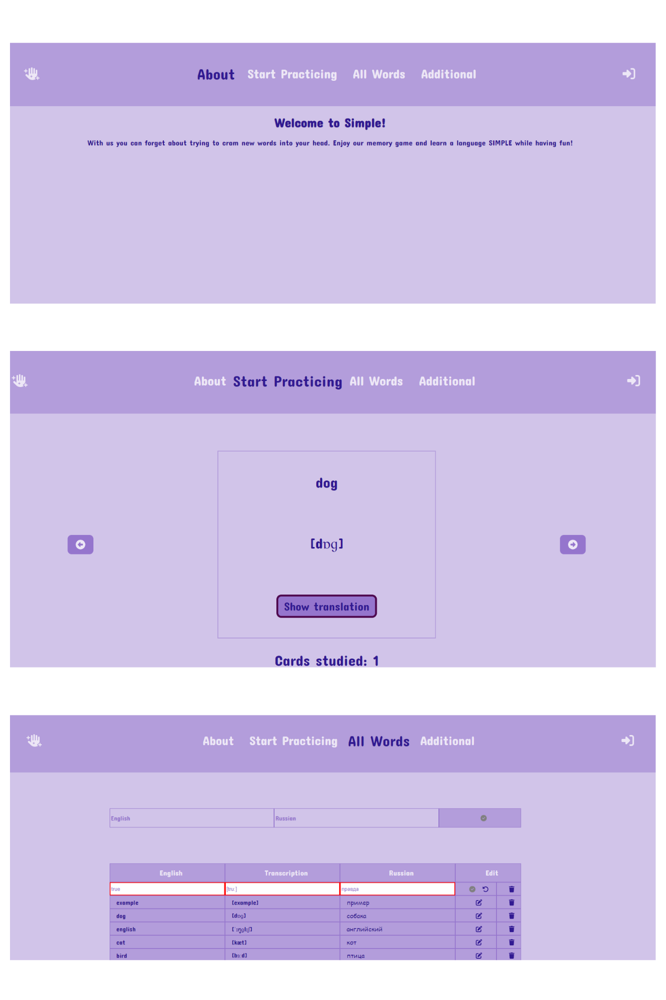

# React application with a Game to learn English words

/ website /

## Application Description and Structure

This is an application called Simple, which contains the following pages: 
- About (general information and description of the application)
- Start Practicing (card game to study words). It allows you to view translations and it also counts how many words you've learned during the session.
- All Words (table with all available words for studying, currently contains a few words as an example, more words will be added to it in the future). It is possible to add new words, edit or delete existed ones.
- Error page

The application design is responsive and works well on both desktop and mobile devices.

## Technologies & tools 

* ReactJS
* React-router
* MobX
* SASS, CSS
* GitHub
* APIs (http://itgirlschool.justmakeit.ru/api/words). All APIs used at work are used solely for educational purposes and are not used for commercial purposes.

## Set up instruction

git clone https://github.com/nastyaclifford/SmartDietTrack_JS.git

In the project directory, you can run:

### `npm start`

Runs the app in the development mode.\
Open [http://localhost:3000](http://localhost:3000) to view it in your browser.

The page will reload when you make changes.\
You may also see any lint errors in the console.

